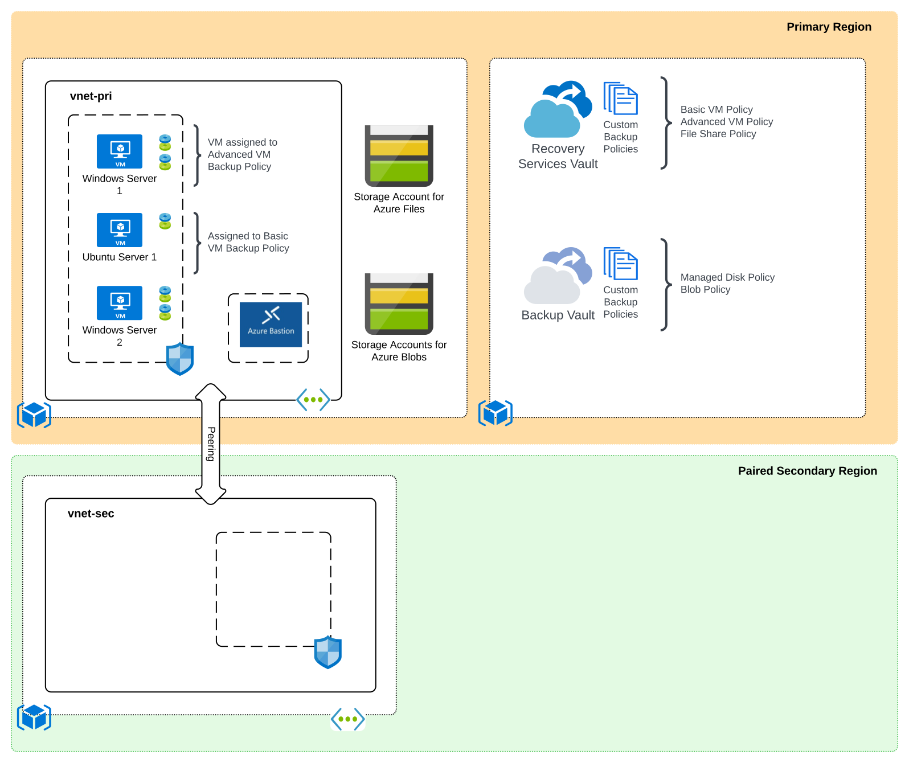

# Azure Backup Demonstration

## Overview
This repository includes a variety of artifacts that can be used to learn and demonstrate a subset of capabilities for [Azure Backup](https://docs.microsoft.com/en-us/azure/backup/backup-overview). Azure Backup is the native backup solution in the Microsoft Azure cloud. It provides backup functionality for workloads running in Azure or on-premises. A detailed listing of which workloads are supported are documented in the [public documentation](https://docs.microsoft.com/en-us/azure/backup/backup-support-matrix). The artifacts in this repository cover **only** the following use cases:

* Azure Virtual Machines
* Azure Managed Disks
* Azure Storage - Blobs
* Azure Storage - File Shares 

## Artifacts
The artifacts include a PowerPoint overview deck, deployable lab to learn and demonstrate features and capabilities, and a step-by-step guide on how to demonstrate specific features (COMING SOON).

## Lab Deployment
The deployable lab included in this repository is coded using [ARM resource templates](https://docs.microsoft.com/en-us/azure/azure-resource-manager/templates/syntax) and uses a combination of PowerShell and Bash scripts and DSC to pre-configure resources deployed.

The resources in this lab are spread across three resource groups spread across the paired regions. The two resource groups deployed in the primary region include the Recovery Services Vault, Backup Vault, VMs, storage accounts, and virtual networks. The third resource group is deployed in the paired secondary region and deploys an empty virtual network that will be used to demonstrate the [cross region restore functionality](https://azure.microsoft.com/en-us/blog/cross-region-restore-crr-for-azure-virtual-machines-using-azure-backup/). 

Both the Recovery Services Vault and Backup Vault include custom backup policies including a basic VM policy, advanced VM policy, Azure Files policy, Azure Managed Disk policy, and Azure Blob policy. The Linux VM (vml-pri-1-cf) is associated with the basic VM backup policy and the Windows VM (vmw-pri-1-cf) is configured with the advanced VM backup policy and also comes with the [MARS agent preinstalled](https://docs.microsoft.com/en-us/azure/backup/install-mars-agent). The third windows VM (vmw-pri-2-ncf) is not configured for any backup policy and is present to allow you to demonstrate association of a backup policy through the Portal.

Two storage accounts are deployed, one used for Azure Files and one used for Azure Blobs. An empty file share named sampleshare is precreated on one storage account and an empty blob container named sampleblobs is configured on the second storage account. You must populate the file share and blob container with your own sample data. You can then associate the file share and blob container with the relevant custom policies in the Recovery Services Vault and Backup Vault.

The MARS agent on the Windows VM (vmw-pri-1-cf) can be setup and integrated with the Recovery Services Vault to demonstrate individual backup and restoration of system state, files, and folders from a Windows VM.

### Prerequisites
1. You must hold at least the [Contributor RBAC role](https://docs.microsoft.com/en-us/azure/role-based-access-control/built-in-roles#contributor) at the subscription scope in the subscription the resources will be deployed to.

2. You must be capable of deploying resources to a set of paired regions. The templates are configured to allow deployment to regions within the US geopolitical region and that have regional pairs. If you wish to deploy to another geopolitical region, you will need to modify the azuredeploy.json template.

3. The virtual machines created in this deployment are deployed into availability zones. The region(s) you deploy the resources to [must support availability zones](https://docs.microsoft.com/en-us/azure/availability-zones/az-region).

### Installation with Azure Portal

Click the Deploy To Azure button below.

### Installation with Azure CLI
1. Set the following variables:
   * DEPLOYMENT_NAME - The name of the location
   * DEPLOYMENT_LOCATION - The location to create the deployment
   * LOCATION - The primary region to deploy resources to
   * SEC_LOCATION - The secondary paired region to deploy resources to. This is used to demonstrate the cross region restore feature.
   * ADMIN_USER_NAME - The name to set for the VM administrator username
   * SUBSCRIPTION- The name or id of the subscription you wish to deploy the resources to

2. Set the CLI to the subscription you wish to deploy the resources to:

   * **az account set --subscription SUBSCRIPTION**

3. Deploy the lab using the command (tags parameter is optional): 

   * **az deployment sub create --name $DEPLOYMENT_NAME --location $DEPLOYMENT_LOCATION --template-uri https://raw.githubusercontent.com/mattfeltonma/azure-backup-demo/main/azuredeploy.json --parameters location=$LOCATION secLocation=$SEC_LOCATION vmAdminUsername=$ADMIN_USER_NAME tags='{"mytag":"value"}'**

4.  You will be prompted to provide a password for the local administrator of the virtual machine.

### Post Installation
Once the lab is deployed, you should wait at least 24 hours for restore points to be generated for the virtual machines. You can remotely access the virtual machines using the deployed Azure Bastion instance.

### Exercises
This repository contains a collection of exercises you can perform with the lab to learn or demonstrate the core features of Azure Backup. You can find [the exercises here](/exercises/README.md).

### Removal of Resources
It is very important you follow the instructions below when you are done with the lab. If you do not follow these instructions, it could result in shadow resources which will require you to work with support to remove.

1. Follow the [instructions here](https://docs.microsoft.com/en-us/azure/backup/backup-azure-delete-vault?tabs=portal) to delete the Recovery Services Vault.

2. Follow the [instructions here](https://docs.microsoft.com/en-us/azure/backup/backup-vault-overview#delete-a-backup-vault) to delete the Backup Vault.

3. DO NOT proceed to this step until you have done steps 1 and 2. Once those steps are complete and both vaults are deleted, you can delete the resource groups containing the resources created as part of this lab.

