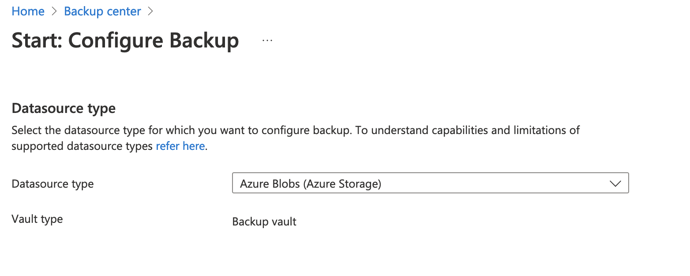
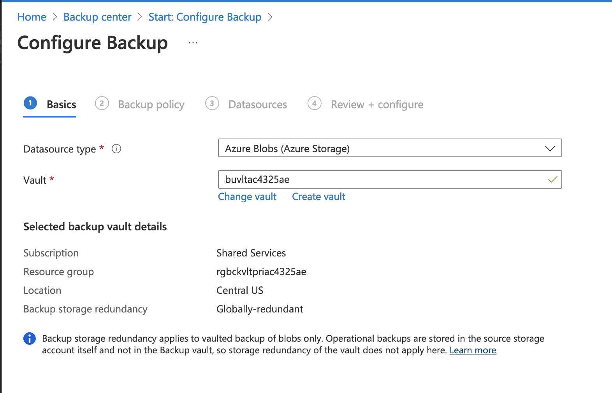
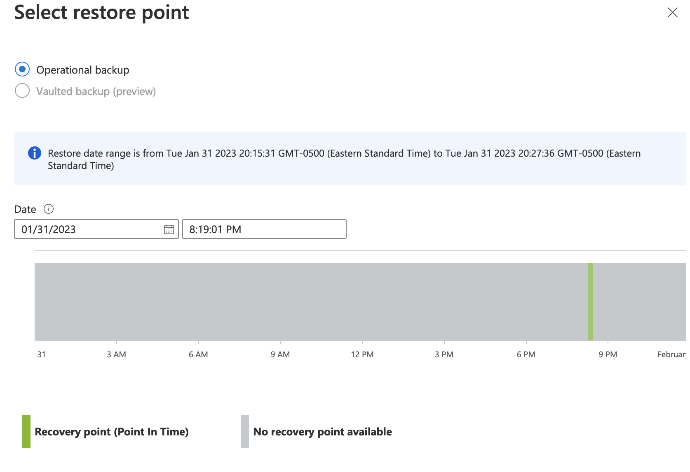
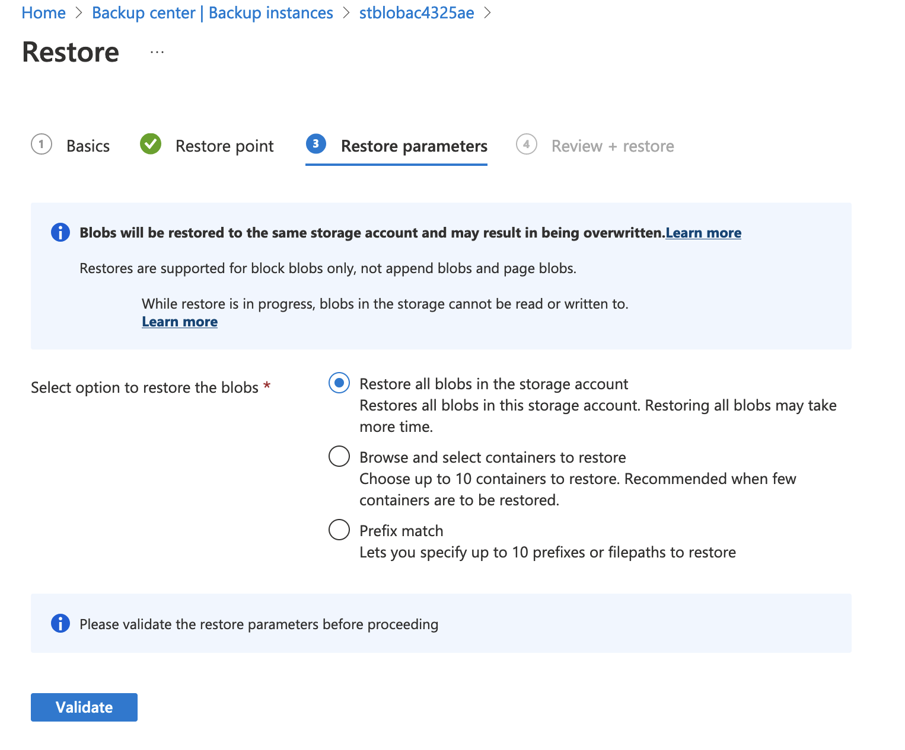

## Exercise 7 - Backup and Restore Azure Blobs

In this exercise you will backup an Azure Blob container for backup.

Open the Azure Portal and [upload the file to sampleblobs container](https://learn.microsoft.com/en-us/azure/storage/blobs/storage-quickstart-blobs-portal) in the storage account beginning with stblob.

Once the file is uploaded, open up Azure Backup Center, navigate to the Oveview page and select the Backup option. Select the Azure Blobs (Azure Storage) as the datasource type and select the Recovery Services Vault with the name beginning with vlt. Select the Continue button.

On the basic page of the Configure Backup select the Azure Blobs (Azure Storage) as the datasource type and select the Backup Vault with the name beginning with buvlt.

On the Backup policy page of the Configure Backup select the backup policy with the name beginning with cstBlobPolicy. Select the next button.

On the Datasources page of the Configure backup select the stblob storage account as a datasource. 

The vault will attempt to configure the storage account for backup. This will fail due to the missing role assignment. When backing up Azure Blobs, the Backup Vault places a delete lock on the storage account. It requires that the system-assigned managed identity for the vault has the Storage Account Backup Contributor role on the storage account.

Select the Assign missing roles option to automatically create the role assignment. It can take up to ten minutes for the roles to propagate across the Azure environment.

Once complete, select the option to complete the backup.

Navigate to the blob container on the stblob storage account and delete the file you uploaded. Note the time you delete the blob, you will need this when selecting a restore point.

Navigate back to Backup Center and open the backup instance for the stblob storage account and select the restore option. Select the restore point and select the Next: Restore parameters button.

On the Restore parameters page you can choose to restore all blobs, a specific container or containers, or restore blobs based on a prefix match. For this exercise you will chose the restore all blobs option. Select the Validate button, then the Next: Review + restore option, and finally the Restore button.

While the restore process is underway, the containers will be unavailable to read or write to. Once complete, the blob you deleted will be restored.

This completes exercise 7.